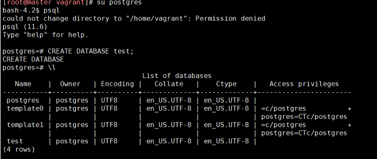
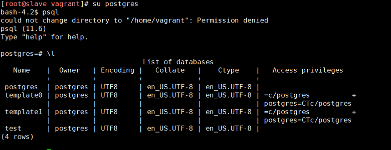

# Домашнее задание
PostgreSQL
- Настроить hot_standby репликацию с использованием слотов
- Настроить правильное резервное копирование

# Проверка

Проверяем работу репликации

Проверяем работу barman

